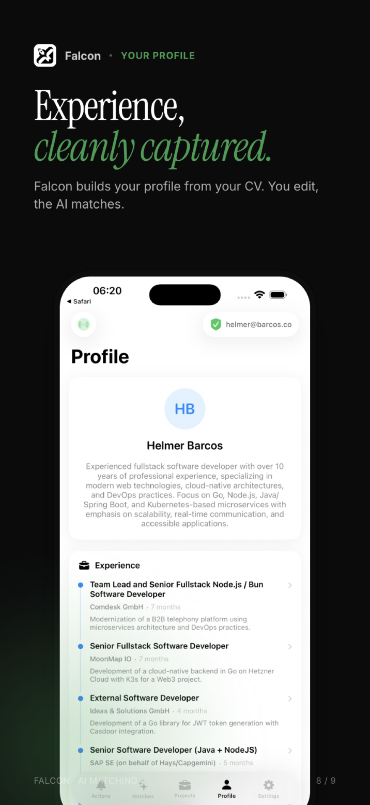
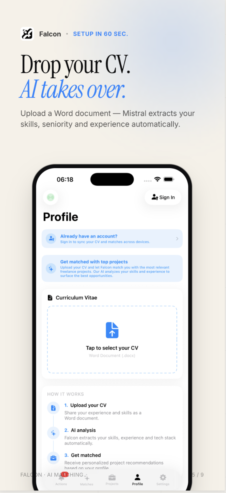
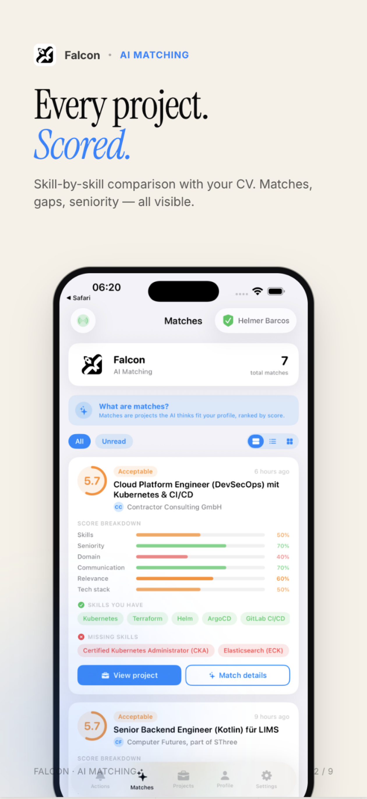
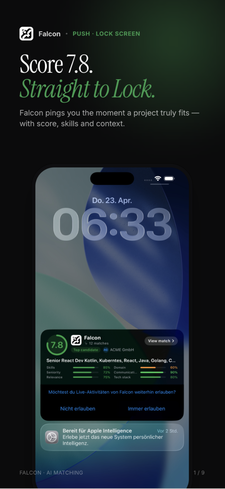
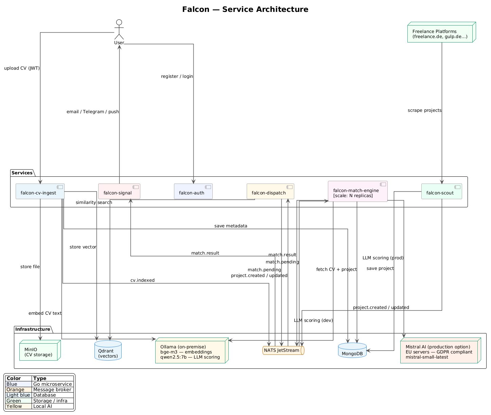
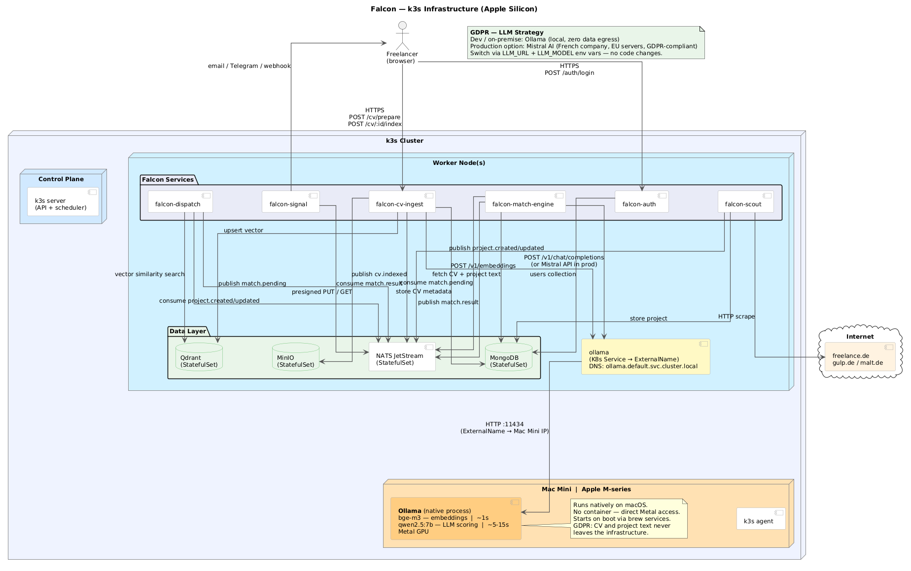

# Falcon 🦅

Hecho en Hamburgo con ❤️, 2026. Visit https://falcon.hblabs.co

<p align="center">
  
  
  
  
</p>

<p align="center">
  <a href="https://apps.apple.com/app/falcon-f%C3%BCr-freelancer/id6763169883">
    
  </a>
</p>



---

## Services

Every Go binary in the repo lives under `falcon-*`.

Each row is tagged with a **type** flag so it's clear at a glance
where the thing runs:

- <code>HTTP</code> : cluster-deployed, listens on HTTP.
- <code>NATS</code> : cluster-deployed, NATS consumer (no HTTP).
- <code>LOCAL</code> : local-only tool, not in the cluster.
- <code>INFRA</code> : backing service (datastore / broker / LLM runtime).


| Type    | Name                    | Port        | What it does                                                                                                                                                                                                 |
| ------- | ----------------------- | ----------- | ------------------------------------------------------------------------------------------------------------------------------------------------------------------------------------------------------------ |
| `HTTP`  | **falcon-api**          | 8081        | Public REST API consumed by the iOS client. JWT-gated. Routes for matches, projects, CVs, companies, system status, admin.                                                                                   |
| `HTTP`  | **falcon-landing**      | 8082        | Static marketing site at falcon.hblabs.co. Serves localized HTML (EN/DE/ES), privacy/terms, App Store badges, `/ios` redirect.                                                                               |
| `HTTP`  | **falcon-realtime**     | 8090        | WebSocket fan-out. Pushes `match.result`, `project.normalized`, `match.flipped` to connected iOS clients. Sticky-session sharded.                                                                            |
|         |                         |             |                                                                                                                                                                                                              |
|         |                         |             |                                                                                                                                                                                                              |
| `NATS`  | **falcon-storage**      | —           | CV upload pipeline (MinIO presign → text extract → embedding → Qdrant). Includes Mistral OCR for PDFs. Also caches company logos.                                                                            |
| `NATS`  | **falcon-normalizer**   | —           | LLM-backed normalization of project + CV text into structured JSON (title, requirements, contact, etc.) per language.                                                                                        |
| `NATS`  | **falcon-dispatch**     | —           | Vector-search dispatcher — forward (project → CVs) and reverse (new CV → recent projects). Publishes `match.pending`.                                                                                        |
| `NATS`  | **falcon-match-engine** | —           | Scores each `match.pending` via LLM across six dimensions. Publishes `match.result` if above threshold. The only horizontally-scaled service.                                                                |
| `NATS`  | **falcon-signal**       | —           | Delivers push notifications via APNs (iOS), Live Activities, and magic-link emails via Mailjet.                                                                                                              |
| `NATS`  | **falcon-scout**        | —           | Polls freelance project boards (redglobal.de, contractor.de, solcom.de, computerfutures.com, somi.de, constaff.com) and emits `project.created` / `project.updated`.                                         |
|         |                         |             |                                                                                                                                                                                                              |
|         |                         |             |                                                                                                                                                                                                              |
| `LOCAL` | **falcon-authorizer**   | 8082        | Local helper that issues 30-day magic-link tokens for App Store reviewers and manual QA. Bearer-auth gated.                                                                                                  |
| `LOCAL` | **falcon-designer**     | 8083        | Static design canvas + dashboard for Claude-generated mockups. Hot-reloads any HTML/JSX/CSS edit.                                                                                                            |
| `LOCAL` | **falcon-nest**         | 8080        | Local dev portal that lists every service, every infra component, and `kubectl port-forward` cheat sheets.                                                                                                   |
| `LOCAL` | **falcon-import**       | —           | One-shot CLIs (e.g. recruiter ratings ingestion from Recruiter Rodeo).                                                                                                                                       |
|         |                         |             |                                                                                                                                                                                                              |
|         |                         |             |                                                                                                                                                                                                              |
| `INFRA` | **MongoDB**             | 27017       | Primary data store — users, CVs, projects, match results, normalized projects, errors/warnings, system metadata. Flexible schema, no migrations.                                                             |
| `INFRA` | **NATS JetStream**      | 4222 / 8222 | At-least-once durable event bus between every service. Subjects: `cv.indexed`, `project.created`, `project.normalized`, `match.pending`, `match.result`, `match.flipped`. Replay survives consumer downtime. |
| `INFRA` | **Qdrant**              | 6333 / 6334 | Vector database. Multi-vector storage — one Qdrant point per CV chunk, payload `cv_id` lets dispatch group chunks per CV at query time.                                                                      |
| `INFRA` | **MinIO**               | 9000 / 9001 | S3-compatible object storage for CV originals (Word + PDF) and company logos. Public-read policy on the logos bucket so iOS Live Activities can load them via the App Group cache.                           |
| `INFRA` | **Ollama**              | 11434       | Local inference runtime. Optional — the production stack runs Mistral; Ollama is the on-premise alternative for fully self-hosted deployments. See section below.                                            |

> ⚠️ **`falcon-match-engine` is the only service that needs horizontal
> scaling.** Each LLM call takes several seconds; a single project can
> fan out to N candidate matches. Add replicas to process them in
> parallel — every pod shares the same NATS durable consumer so each
> message lands on exactly one pod.

---

## LLM strategy and GDPR

Falcon's AI pipeline has two stages. **embedding** (CV text → vector)
and **scoring** (CV × project → match score). Both stages currently
run on **Mistral AI** in France (EU), which is what makes Falcon
GDPR-compliant by design.

| Stage         | Model                  | Provider        | Notes                                                                |
| ------------- | ---------------------- | --------------- | -------------------------------------------------------------------- |
| Embedding     | `codestral-embed`      | Mistral AI (EU) | Used by `falcon-storage` (CVs) and `falcon-dispatch` (projects).     |
| Match scoring | `mistral-small-latest` | Mistral AI (EU) | Used by `falcon-match-engine`.                                       |
| OCR (PDF CVs) | `mistral-ocr-latest`   | Mistral AI (EU) | Used by `falcon-storage` for PDF uploads.                            |
| Normalization | `mistral-small-latest` | Mistral AI (EU) | Used by `falcon-normalizer` for project + CV text → structured JSON. |

CV and project text are **personal data** under GDPR. Mistral is
EU-based, operates EU-hosted infrastructure, and doesn't train on
submitted content — every stage of the pipeline stays inside the EU.

The pipeline is **model-agnostic**. A fully self-hosted alternative
(Ollama with `bge-m3` for embeddings + `qwen2.5:7b` for scoring) is
supported via env-var swap; no code changes needed.

> ⚠️ Do not point any of these env vars (`EMBEDDINGS_URL`, `LLM_URL`,
> `OCR_URL`) at OpenAI, Anthropic, Google, or any non-EU provider
> without a fresh DPA review. Mistral is the safe default.

## Running Ollama natively on Apple Silicon

Docker on macOS runs inside a Linux VM with no access to the Metal
GPU, forcing CPU-only inference (~23s per embedding). Running Ollama
natively uses Metal and brings that down to under 1s.

```bash
# Install
brew install ollama

# Start the server (runs on http://localhost:11434)
ollama serve

# Pull both models
ollama pull bge-m3        # embeddings — used by storage and dispatch
ollama pull qwen2.5:7b    # LLM scoring — used by match-engine
```

Ollama will start automatically on login after installation. The
rest of the stack (`docker compose up`) connects to it at
`http://host.docker.internal:11434` — point `EMBEDDINGS_URL` and
`LLM_URL` in your `.env` there to opt out of Mistral.

> On Linux with an NVIDIA GPU, use the Docker service in
> `docker-compose.yml` (see the commented block) and add the
> `nvidia` runtime instead.

## Production Infrastructure (k3s / k8s)



All Falcon microservices and stateful components (MongoDB, Qdrant,
NATS, MinIO) run as standard Kubernetes workloads and can be
deployed to any k3s or k8s cluster.

### Ollama on Apple Silicon

Ollama cannot access the Metal GPU from inside a container (no Metal
passthrough exists in any virtualisation layer on macOS). The
solution is to run Ollama **natively on the host** and expose it to
the cluster over HTTP.

Recommended setup with a Mac Mini (M-series) as a dedicated
inference node:

1. Install and start Ollama natively on the Mac Mini:
   ```bash
   brew install ollama
   ollama pull bge-m3
   brew services start ollama   # starts on boot
   ```
2. Add the Mac Mini as a k3s agent node normally.
3. Create a Kubernetes `Service` + `Endpoints` pointing to
   `http://<mac-mini-ip>:11434` so pods resolve Ollama via a stable
   in-cluster DNS name.
4. Set `EMBEDDINGS_URL=http://ollama.default.svc.cluster.local/v1/embeddings`
   in the `falcon-storage` deployment (and `LLM_URL` in
   `falcon-match-engine` if scoring also runs locally).

This gives full Metal GPU acceleration (<1s per embedding) with
zero changes to the application code. See `docs/k3s-infrastructure.puml`
for the full topology.

### Deployment scripts

```
deployment/
├── apps/        # one yaml per Falcon service
├── infra/       # mongo, nats, qdrant, minio, ingress, namespace
├── configs/     # configmap + secret + registry-access (gitignored)
└── scripts/
    ├── _lib.sh       # shared paths + namespace helpers
    ├── rollout.sh    # zero-downtime rolling update
    ├── redeploy.sh   # hard replace (immutable-field changes only)
    └── logs.sh       # multiplexed log tail across every pod
```

Daily iteration: `deployment/scripts/rollout.sh` </br>
Daily iteration with filter: `deployment/scripts/rollout.sh api signal` </br>
Tail: `deployment/scripts/logs.sh`
