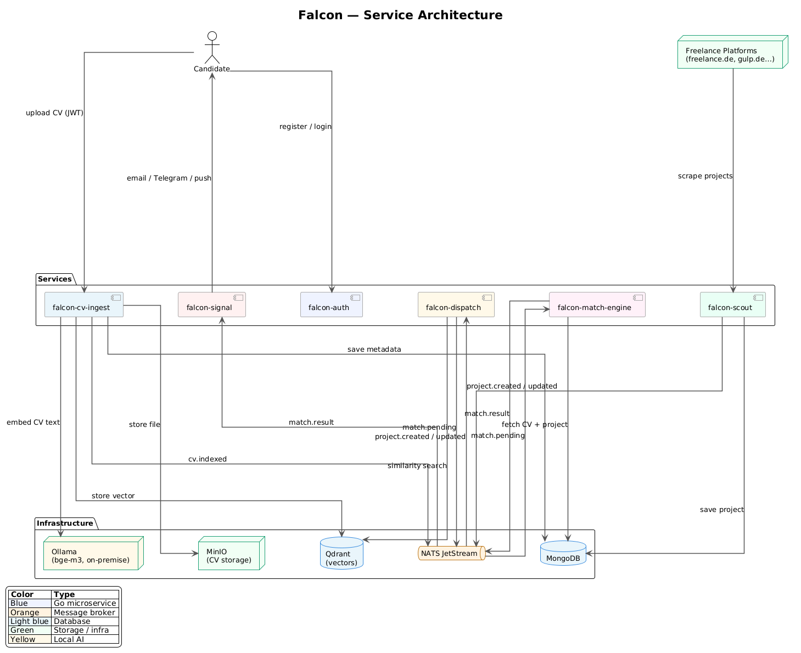

# Falcon

## Microservices

**falcon-auth** — Handles authentication and authorization across the entire platform. Issues and validates JWT tokens, manages user registration and login, and acts as the identity provider for all other services.

**falcon-cv-ingest** — Accepts CV uploads in Word format from candidates. Extracts raw text from the documents, generates vector embeddings via an embeddings API, stores the binary file in MinIO, saves metadata in MongoDB, and stores the vector in Qdrant. Publishes a `cv.indexed` event to NATS when processing is complete.

**falcon-scout** — Continuously scrapes freelance portals (freelance.de, gulp.de, malt.de, etc.) looking for new projects. Stores project data and metadata in MongoDB and publishes a `project.created` event to NATS for every new project detected, or `project.updated` when an existing project changes.

**falcon-dispatch** — Consumes `project.created` and `project.updated` events from NATS. Performs a fast vector similarity search in Qdrant to find candidates whose CVs are semantically close to the new project description. For each candidate above the similarity threshold, publishes a `match.pending` message to the match queue in NATS.

**falcon-match-engine** — Pool of workers that consume `match.pending` messages from NATS. Each worker fetches the full CV text and project description, calls the LLM (Claude Haiku or Gemini Flash) to produce a match score and a human-readable explanation, and publishes a `match.result` event if the score exceeds the configured threshold. Scales horizontally by adding more worker instances.

**falcon-signal** — Consumes `match.result` events from NATS and delivers real-time notifications to the matched candidate via their preferred channel — email, Telegram bot, push notification, or webhook.

## Infrastructure

**MongoDB** — NoSQL document database used as the primary data store across services. Stores candidate metadata (ingested from CVs), raw project data scraped by falcon-scout, and match results. Chosen for its flexible schema, which accommodates evolving document structures without migrations.

**Qdrant** — Vector database purpose-built for high-performance similarity search. Stores the embeddings generated from CV text and project descriptions. falcon-dispatch queries Qdrant to find semantically similar CV/project pairs in milliseconds, even at large scale. Supports filtering and payload storage alongside vectors.

**NATS JetStream** — Distributed messaging system with persistent, at-least-once delivery guarantees (JetStream layer on top of core NATS). Used as the event bus between all services: `cv.indexed`, `project.created`, `project.updated`, `match.pending`, and `match.result` events flow through it. JetStream provides durable subscriptions and replay, so no events are lost if a consumer is temporarily down.

**Ollama** — Local inference server that runs embedding models on-premise. falcon-cv-ingest uses it to generate vector embeddings from CV text via an OpenAI-compatible API (`/v1/embeddings`). Running embeddings locally means candidate CV data never leaves the infrastructure, which is a hard requirement under GDPR. The model in use is `bge-m3`, chosen for its strong multilingual performance — relevant because CVs and project descriptions on the platform are predominantly in German.

**MinIO** — S3-compatible object storage deployed on-premises. Stores the original CV binary files (Word documents) uploaded by candidates. Services access files through the standard S3 API, making it straightforward to swap for AWS S3 or GCS in production without code changes.