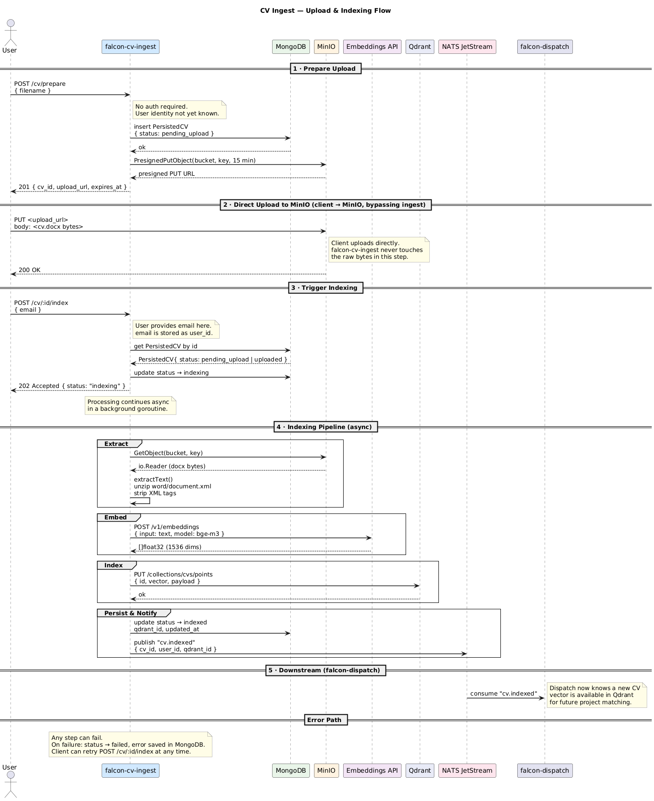

# falcon-cv-ingest

Accepts CV uploads in Word format from anonymous users, extracts text, generates
vector embeddings via Ollama, and stores everything needed for downstream matching.



## Flow

1. **Prepare** — client calls `POST /cv/prepare { filename }`. Service creates a
   pending record in MongoDB and returns a presigned MinIO PUT URL (valid 15 min).
2. **Upload** — client uploads the `.docx` file directly to MinIO using the
   presigned URL. falcon-cv-ingest never touches the raw bytes at this step.
3. **Index** — client calls `POST /cv/:id/index { email }`. Service upserts a
   `User` record by email (creating one if new), then launches async processing.
4. **Processing (async)**
   - Downloads the file from MinIO
   - Extracts plain text from `word/document.xml` (handles paragraphs, tables, line breaks)
   - Generates a 1024-dim embedding via Ollama `bge-m3` (on-premise, GDPR compliant)
   - Upserts the vector into Qdrant with `user_id` + `filename` as payload
   - Updates MongoDB status → `indexed`
   - Publishes `cv.indexed` to NATS JetStream

## API

| Method | Path | Auth | Body |
|--------|------|------|------|
| `GET` | `/health` | — | — |
| `POST` | `/cv/prepare` | — | `{ "filename": "cv.docx" }` |
| `POST` | `/cv/:id/index` | — | `{ "email": "user@example.com" }` |
| `GET` | `/cv/:id` | Bearer JWT | — |

## Environment variables

| Variable | Required | Description |
|----------|----------|-------------|
| `MONGODB_URI` | ✅ | MongoDB connection string |
| `MONGODB_DATABASE` | ✅ | Database name |
| `NATS_URL` | ✅ | NATS JetStream URL |
| `MINIO_ENDPOINT` | ✅ | MinIO host:port |
| `MINIO_ACCESS_KEY` | ✅ | MinIO access key |
| `MINIO_SECRET_KEY` | ✅ | MinIO secret key |
| `MINIO_BUCKET` | ✅ | Bucket for CV files |
| `MINIO_USE_SSL` | — | `true`/`false`, default `false` |
| `QDRANT_URL` | ✅ | Qdrant REST URL |
| `QDRANT_COLLECTION` | ✅ | Collection name |
| `QDRANT_VECTOR_DIM` | ✅ | Embedding dimensions (`1024` for bge-m3) |
| `EMBEDDINGS_URL` | ✅ | Ollama endpoint (`/v1/embeddings`) |
| `EMBEDDINGS_API_KEY` | ✅ | API key (`ollama` for local) |
| `EMBEDDINGS_MODEL` | ✅ | Model name (`bge-m3`) |
| `JWT_SECRET` | ✅ | Shared secret for JWT validation |
| `PORT` | — | HTTP port, default `8081` |

## Running locally

```bash
# Start infrastructure
docker compose up -d # run at to root dir

# Start Ollama natively (Apple Silicon — required for Metal GPU)
ollama serve

# Run the service
cp .env.example .env   # adjust values if needed
go run .
```

> Embeddings run on-premise via Ollama. CV text never leaves your infrastructure — GDPR requirement.
