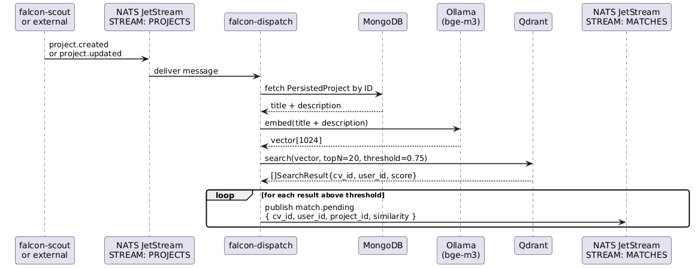

# falcon-dispatch

Consumes project events from NATS, embeds the project description via Ollama,
searches Qdrant for matching CVs, and publishes a `match.pending` event for each
candidate above the similarity threshold.



## Flow

1. **Event received** — subscribes to `project.created` and `project.updated` on
   the `PROJECTS` JetStream stream.
2. **Fetch project** — loads the full `PersistedProject` from MongoDB by ID.
3. **Embed** — concatenates `title + description` and generates a 1024-dim vector
   via Ollama `bge-m3` (on-premise, GDPR compliant).
4. **Search** — queries Qdrant for the top N CVs above the score threshold.
5. **Publish** — emits one `match.pending` message per result onto the `MATCHES`
   stream, carrying `cv_id`, `user_id`, `project_id`, `platform`, and `similarity`.

`falcon-match-engine` consumes `match.pending` and performs the detailed LLM scoring.

## Environment variables

| Variable | Required | Description |
|----------|----------|-------------|
| `MONGODB_URI` | ✅ | MongoDB connection string |
| `MONGODB_DATABASE` | ✅ | Database name |
| `NATS_URL` | ✅ | NATS JetStream URL |
| `QDRANT_URL` | ✅ | Qdrant REST URL |
| `QDRANT_COLLECTION` | ✅ | Collection name |
| `EMBEDDINGS_URL` | ✅ | Ollama endpoint (`/v1/embeddings`) |
| `EMBEDDINGS_API_KEY` | ✅ | API key (`ollama` for local) |
| `EMBEDDINGS_MODEL` | ✅ | Model name (`bge-m3`) |
| `DISPATCH_TOP_N` | — | Max candidates per project, default `20` |
| `DISPATCH_SCORE_THRESHOLD` | — | Min cosine similarity, default `0.75` |

## Running locally

```bash
# Start infrastructure
docker compose up -d   # run at root dir

# Start Ollama natively (Apple Silicon — required for Metal GPU)
ollama serve

# Run the service
cp .env.example .env   # adjust values if needed
go run .
```

> Embeddings run on-premise via Ollama. Project text never leaves your infrastructure — GDPR requirement.
